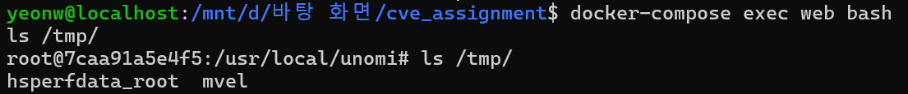

# Apache Unomi OGNL/MVEL Expression Injection RCE (CVE-2020-13942)

## 1. 취약점 요약 (Summary)
Apache Unomi 1.5.1 이전 버전에서 발생하는 취약점으로, 악의적인 사용자가 조작된 MVEL 또는 OGNL 표현식을 포함한 요청(JSON)을 전송하여 서버 권한으로 임의의 시스템 명령어를 실행(RCE)할 수 있습니다.

## 2. 환경 구성 (Environment Setup)
아래 명령어를 통해 취약한 Apache Unomi 환경을 실행합니다. 

```bash
docker-compose up -d
```

## 3. 재현 절차 및 실행 결과 (PoC)
1. 환경이 정상적으로 실행된 후, `poc.py` 스크립트를 실행하여 악성 페이로드를 전송합니다.
```bash
python3 poc.py
```
2. 컨테이너 내부로 진입하여 `/tmp` 디렉토리에 `mvel` 파일이 성공적으로 생성되었는지 확인합니다.
```bash
docker-compose exec web bash
ls /tmp/
```

**[실행 결과 스크린샷]**


**[mvel 파일 생성의 보안상 의미]**
단순한 빈 파일(mvel) 생성으로 보일 수 있으나, 이는 공격자가 서버 내에서 원래 애플리케이션의 의도를 완전히 벗어나 **원하는 임의의 시스템 명령어를 아무런 제약 없이 실행(RCE)할 수 있음**을 증명하는 결정적 지표입니다. 

실제 공격 상황에서 이 페이로드의 명령어가 파일 생성이 아닌 민감한 데이터 읽기(`cat /etc/passwd`), 핵심 파일 삭제(`rm -rf`), 혹은 악성 쉘 스크립트 다운로드 및 실행 등으로 변경될 경우, 시스템 장악 및 치명적인 데이터 유출 사고로 직결되는 매우 심각한 보안 위협입니다.

## 4. 대응 방안 (Mitigation)
* 버전 업데이트: Apache Unomi 버전을 1.5.2 이상으로 업데이트하여 패치를 적용합니다.
* 입력값 검증: 애플리케이션 내에서 OGNL 및 MVEL 표현식 입력값에 대한 철저한 필터링을 수행합니다.